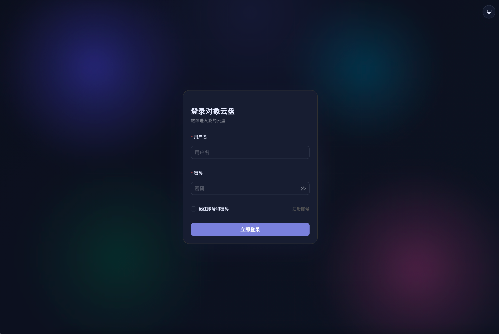
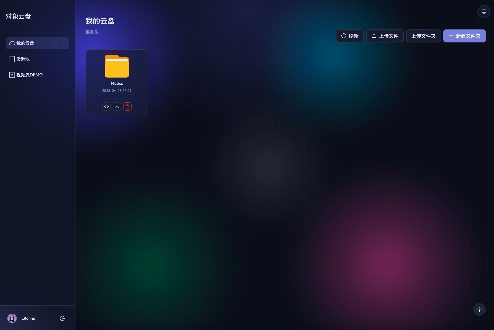

# Object Cloud Drive 说明书



Object Cloud Drive 是一个仿云盘项目，包含桌面/网页客户端和 Rust 后端服务。项目支持用户登录、文件上传、文件夹上传、拖拽多文件/目录上传、BLAKE3 分片树哈希、秒传、分片并发上传、断点续传、文件/文件夹下载、多类型文件预览、资源池浏览、头像上传裁剪、深色主题、移动端适配和动态背景等功能。

## 技术栈

- 前端：React 18、TypeScript、Vite、Ant Design、Tauri、PixiJS
- 后端：Rust、Actix Web、SQLx、SQLite
- 存储：本地文件系统 + SQLite 元数据
- 鉴权/加密：RSA 公钥加密登录参数，后端自动生成密钥对

## 目录结构

```text
object-cloud-drive/
├── client/              # 新版 React/Tauri 客户端
├── serve_rust/          # 新版 Rust 后端
├── resources/           # 项目资源
└── README.md            # 项目说明书
```

## 功能说明

- 用户：注册、登录、自动获取公钥、头像上传、头像画布裁剪。
- 云盘：新建文件夹、上传文件、上传文件夹、拖拽上传多个文件/目录、删除文件/文件夹。
- 上传：BLAKE3 分片树哈希计算、秒传、分片并发上传、断点续传、上传进度/速度展示、任务取消、0KB 文件上传。
- 下载：单文件支持 HTTP Range 并发分片下载，文件夹由后端打包为 ZIP 后下载。
- 预览：图片预览、视频流预览、音频播放、文本/代码/Markdown 预览、PDF/HTML 内嵌预览、同目录媒体列表、视频缩略图。
- 资源池：浏览服务端指定目录，过滤隐藏文件/目录，支持图片、音频、视频、文本、代码、Markdown、PDF、HTML 等文件预览。
- 界面：响应式卡片布局、深色主题、移动端双列布局、动态 canvas/PixiJS 背景、玻璃拟态效果、上传/下载传输中心。

## 环境要求

- Node.js：建议 18+
- pnpm：建议使用 pnpm 管理前端依赖
- Rust：建议 stable 工具链
- SQLite：由后端通过 SQLx 自动创建数据库和表结构，无需手动建表
- ffmpeg：音视频预览需要 ffmpeg 支持，确保 ffmpeg 可执行文件在系统 PATH 中

## 后端启动

进入 Rust 后端目录：

```bash
cd serve_rust
cargo run
```

默认监听：

```text
http://localhost:3000
```

后端首次启动会自动创建：

- SQLite 数据库：`serve_rust/objcloud.db3`
- 媒体类型缓存表：`t_media_type_cache`
- RSA 密钥目录：`~/.objectcloud/key/`
- 上传临时目录：`~/.objectcloud/temp/`
- 文件存储目录：`~/.objectcloud/upload/`
- 预览缓存目录：`~/.objectcloud/preview/`

如果修改了后端代码，需要重启 `serve_rust`。

## 后端配置

当前配置集中在：

```text
serve_rust/src/config.rs
```

主要配置项：

```text
db_path            SQLite 数据库路径，默认 objcloud.db3
upload_temp_dir    分片上传临时目录，默认 ~/.objectcloud/temp
upload_dir         文件实际存储目录，默认 ~/.objectcloud/upload
preview_dir        预览缓存目录，默认 ~/.objectcloud/preview
resource_pool_dir  资源池根目录，当前默认 /Volumes/Data/
static_dir         静态文件目录，默认 serve_rust/src/
```

如果你的机器不是 macOS，或者没有 `/Volumes/Data/`，需要把 `resource_pool_dir` 改成实际存在的目录。

## 前端启动

进入客户端目录：

```bash
cd client
pnpm install
pnpm dev
```

构建生产包：

```bash
pnpm build
```

Tauri 桌面模式：

```bash
pnpm "tauri dev"
```

## 前端接口地址

接口基础地址在：

```text
client/src/script/api.ts
```

当前默认：

```ts
BASEURL: 'http://192.168.50.48:3000'
```

如果后端运行在本机，可以改成：

```ts
BASEURL: 'http://localhost:3000'
```

前端请求失败、一直加载、获取公钥失败时，优先检查这里的地址是否和后端实际地址一致。

## 使用流程

1. 启动 Rust 后端：`cd serve_rust && cargo run`
2. 启动前端：`cd client && pnpm dev`
3. 打开前端页面。
4. 注册账号，内部注册码为：`OBJECT`
5. 登录后进入云盘页面。
6. 可以上传文件、拖拽上传多个文件或目录、预览图片/视频、下载文件或文件夹。

## 上传说明

上传前端会先在 Web Worker 中按 64MB 分片并行计算 BLAKE3 子哈希，再生成项目自定义树根哈希，避免大文件哈希时阻塞页面：

- 如果用户目录中已经存在同名同后缀文件，会显示“文件已存在”。
- 如果服务器已经有相同文件哈希，会走秒传。
- 如果服务器没有该文件，会按分片并发上传。
- 每个上传分片都会在后端校验大小和 BLAKE3 子哈希，所有分片到齐后再校验树根哈希。
- 如果上传中断，重新选择同一个文件时，前端会询问后端已存在的分片并跳过这些分片继续上传。
- 上传任务可以在传输中心取消；取消会中止哈希计算和正在进行的网络请求。
- 0KB 文件允许上传，会作为空文件入库并创建实际空文件。
- 上传中刷新或关闭页面会中断当前任务，前端会弹出浏览器确认提示。刷新后浏览器无法自动恢复本地 `File` 对象，需要重新选择同一个文件后继续断点续传。
- 拖拽上传会先同步读取全部拖入项，再异步解析文件/目录，支持一次拖入多个文件、多个目录或文件目录混合上传。

重复上传同名文件时，前端会自动追加序号，例如：

```text
文件.txt
文件 (1).txt
文件 (2).txt
```

## 下载说明

- 文件：小文件直接请求 Blob 下载；大文件使用 HTTP Range 并发分片下载，前端合并 Blob 后触发浏览器下载。
- 文件夹：前端请求后端 `/drive/downloadUserFolder`，后端递归读取目录树，生成 ZIP 后返回。
- 下载任务会显示在传输中心的“下载”页签中，包含进度、速度、状态和失败信息。

当前 ZIP 使用“存储模式”，也就是只打包不压缩。优点是速度快、无需额外依赖；缺点是 ZIP 体积不会比原文件小。

## 传输中心说明

右下角浮动按钮用于打开传输中心。存在上传或下载任务时，按钮会显示任务数量并播放轻量动态动画；失败任务会显示红色角标。

传输中心包含：

- 上传页签：显示文件名、上传状态、已上传大小、总大小、速度、进度、状态文案和错误信息。
- 下载页签：显示文件名、下载状态、已下载大小、总大小、速度、进度、状态文案和错误信息。
- 清理已完成：移除已完成或失败的传输记录。

状态标签会固定宽度显示，不会被长文件名挤压；长文件名会自动省略。

## 文件预览说明

当前云盘和资源池共用同一套文件类型识别逻辑：

- 图片：`png`、`jpg`、`jpeg`、`gif`、`webp`、`avif`、`svg`、`bmp`、`ico`、`tif`、`tiff` 等。
- 视频：`mp4`、`webm`、`mkv`、`avi`、`wmv`、`m4v`、`mov`、`flv`、`rmvb`、`3gp`、`vob`、`mpeg`、`mpg` 等。
- 音频：`mp3`、`aac`、`m4a`、`wav`、`ogg`、`oga`、`opus`、`alac`、`flac`、`ape`、`wma` 等。
- 文本/代码：`txt`、`log`、`csv`、`json`、`xml`、`yaml`、`js`、`ts`、`tsx`、`css`、`less`、`py`、`java`、`go`、`rs`、`sql`、`md`、`html` 等。
- 文档/常见文件：`pdf` 可内嵌预览；Word、Excel、PPT、压缩包、安装包、数据库、设计稿等会显示对应文件图标，不支持内嵌预览时会尝试交给浏览器打开。

视频和音频预览使用 HTTP Range 流式加载，适合大媒体文件播放。视频弹窗右侧会显示同目录视频列表和缩略图，点击可切换播放；音频弹窗支持播放列表、进度、音量和 PixiJS 频谱可视化。

如果视频预览很慢，优先检查：

- 后端是否已重启到最新代码。
- 视频文件是否可被后端读取。
- 浏览器 Network 中 Range 请求是否返回 `206 Partial Content`。
- 资源池路径是否配置正确。

## 资源池说明

资源池用于浏览后端机器上的本地目录，配置项是：

```text
serve_rust/src/config.rs -> resource_pool_dir
```

资源池会过滤隐藏文件和隐藏文件夹。文件列表会优先按后缀识别音视频类型；后缀无法判断时，后端会调用 `ffprobe` 探测媒体类型，并把结果写入 `t_media_type_cache`。缓存键包含来源、路径/文件标识、文件大小和修改时间，文件变化后会自动刷新缓存。

## 主题和界面

客户端会跟随系统深色/浅色主题。页面首次加载时会在 `index.html` 中同步设置主题，避免深色模式下出现白屏闪烁。

背景使用 canvas/PixiJS 绘制动态模糊光晕，不同刷新可能出现不同背景效果，例如光晕、极光、星云等。

云盘、资源池、音视频弹窗和传输任务抽屉都做了移动端适配。移动设备上单击即可打开文件/文件夹，桌面端仍以双击打开为主。

## 常见问题

### 1. 前端一直卡在获取公钥

检查：

- 后端是否运行。
- `client/src/script/api.ts` 的 `BASEURL` 是否正确。
- 浏览器 Network 中 `/user/getpublickey` 是否能请求到。

### 2. 登录提示解密失败

通常是后端密钥或服务状态不一致。尝试：

- 重启 Rust 后端。
- 确认前端连接的是当前运行的后端。
- 如需要重置密钥，可停止后端后删除 `~/.objectcloud/key/`，再重新启动后端。

### 3. 上传目录失败

新版前端支持通过拖拽目录上传，也支持“上传文件夹”按钮上传。浏览器需要支持 `webkitGetAsEntry` 或 `webkitdirectory`，Chrome/Edge 通常支持较好。

### 4. 资源池为空

检查 `serve_rust/src/config.rs` 中的 `resource_pool_dir` 是否存在，且后端进程有读取权限。

### 5. 修改后端代码后前端功能没变化

后端改动需要重启 `serve_rust`，前端改动需要重新构建或等待 Vite 热更新。

## 主要接口

用户：

```text
POST /user/getpublickey
POST /user/registered
POST /user/login
POST /user/updateAvatar
```

云盘：

```text
POST /drive/addUserFolder
POST /drive/batchAddUserFolder
POST /drive/getUserFileAndFolder
POST /drive/getUserFileForFileId
POST /drive/downloadUserFolder
POST /drive/delUserFileOrFolder
```

上传：

```text
POST /upload/examineFile
PUT  /upload/uploadStreamFile
POST /upload/uploadSecondPass
```

视频：

```text
GET  /video/playVideoSteam
POST /video/playVideoSteam
GET  /video/playLocalVideoSteam
POST /video/getVideoSceenshots
```

资源池：

```text
GET  /resourcepool/playVideoSteam
POST /resourcepool/playVideoSteam
POST /resourcepool/getVideoSceenshots
POST /resourcepool/getFolderAndFile
```

## 开发建议

- 前端改动后运行：`cd client && pnpm build`
- 后端改动后运行：`cd serve_rust && cargo check`
- 涉及接口地址、资源池路径、存储目录时，优先检查配置文件。
